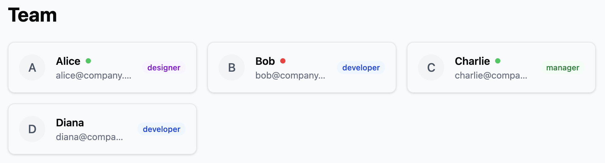
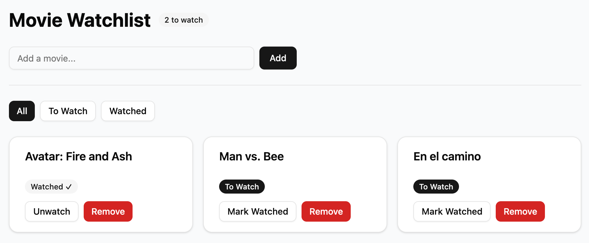

<!-- _class: lead -->

# Seminar 02 — React Components, Tailwind CSS, shadcn/ui

## PB138 — Basics of Web Development

---

## Agenda

1. **React Components** — props, composition, conditional rendering (~20 min)
2. **Tailwind CSS** — utility-first styling, layout, interactivity (~25 min)
3. **shadcn/ui** — setup, component library, building UIs (~25 min)
4. **Buffer / Q&A** (~10 min)

> 🛠 Total coding time: ~30 min across 3 tasks + bonus

---

## Part 1: React Components

---

### What is a Component?

A component is a **function that returns JSX**: **UI = f(props, state)**

```tsx
function Greeting() {
  return <h1>Hello, world!</h1>;
}
```

- Starts with an **uppercase** letter
- Returns **one root element** (or a fragment `<>...</>`)

---

### Props — Passing Data to Components

Props are **inputs** to your component.

```tsx
type GreetingProps = {
  name: string;
  subtitle?: string;
};

function Greeting({ name, subtitle }: GreetingProps) {
  return (
    <div>
      <h1>Hello, {name}!</h1>
      {subtitle && <p>{subtitle}</p>}
    </div>
  );
}
```

```tsx
<Greeting name="Alice" subtitle="Welcome back" />
<Greeting name="Bob" />
```

---

### Children — Composition

The `children` prop lets you **nest content** inside a component.

```tsx
type CardProps = { children: React.ReactNode };

function Card({ children }: CardProps) {
  return <div className="border rounded p-4">{children}</div>;
}
```

```tsx
<Card>
  <h2>Title</h2>
  <p>Any content goes here.</p>
</Card>
```

---

### Conditional Rendering

```tsx
// Short-circuit with &&
function Alert({ message, visible }: { message: string; visible: boolean }) {
  return <div>{visible && <p>⚠️ {message}</p>}</div>;
}

// Ternary for if/else
function Status({ isOnline }: { isOnline: boolean }) {
  return <span>{isOnline ? "🟢 Online" : "🔴 Offline"}</span>;
}
```

---

### Rendering Lists with .map()

Always provide a unique `key` prop.

```tsx
type User = { id: number; name: string; role: string };

const users: User[] = [
  { id: 1, name: "Alice", role: "Admin" },
  { id: 2, name: "Bob", role: "Editor" },
];

function UserList() {
  return (
    <ul>
      {users.map((user) => (
        <li key={user.id}>
          {user.name} — {user.role}
        </li>
      ))}
    </ul>
  );
}
```

---

### File Organization

One component per file. Named exports preferred.

```
src/
├── components/
│   ├── UserList.tsx
│   ├── StatusBadge.tsx
│   └── TeamMemberCard.tsx
├── App.tsx
└── main.tsx
```

---

### ✏️ Task 1 — TeamMemberCard Component (~5 min)

Create a `TeamMemberCard` component:

1. Props: `name` (string), `role` (`"designer" | "developer" | "manager"`), `email` (string), optional `available` (boolean)
2. Render name, email, and role label
3. If `available` is defined, show a status indicator ("Available" / "Busy")

In `App.tsx`, render a **list of team members** using `.map()`:

```tsx
const team = [
  { id: 1, name: "Alice", role: "designer", email: "alice@company.com", available: true },
  { id: 2, name: "Bob", role: "developer", email: "bob@company.com", available: false },
  { id: 3, name: "Charlie", role: "manager", email: "charlie@company.com", available: true },
  { id: 4, name: "Diana", role: "developer", email: "diana@company.com" },
];
```

---

## Part 2: Tailwind CSS

---

### What is Tailwind?

**Utility-first CSS framework** — compose styles directly in markup.

```css
/* Traditional CSS */
.card {
  padding: 16px;
  background: white;
  border-radius: 8px;
}
```

```tsx
// Tailwind
<div className="p-4 bg-white rounded-lg shadow-sm">
```

---

### Why Tailwind?

- No naming things (`.card-wrapper-inner`... never again)
- No switching between files
- Dead code elimination — only used classes ship to production

---

### Setup in Vite + React

```bash
npm install -D tailwindcss @tailwindcss/vite
```

```ts
// vite.config.ts
import { defineConfig } from "vite";
import react from "@vitejs/plugin-react";
import tailwindcss from "@tailwindcss/vite";

export default defineConfig({
  plugins: [react(), tailwindcss()],
});
```

```css
/* src/index.css */
@import "tailwindcss";
```

---

### Core Utilities — Spacing & Typography

```tsx
<div className="p-4 m-2">           {/* 16px padding, 8px margin */}
<div className="px-6 py-3">         {/* horizontal / vertical */}

<h1 className="text-3xl font-bold">Big Bold Title</h1>
<p className="text-sm text-gray-500">Small muted text</p>
```

Spacing scale: `1` = 4px, `2` = 8px, `4` = 16px, `8` = 32px ...

---

### Core Utilities — Colors & Borders

```tsx
<div className="bg-blue-500 text-white">Blue box</div>
<div className="bg-gray-100 text-gray-900">Light card</div>

<div className="border border-gray-200 rounded-lg">Bordered</div>
<div className="shadow-lg">Shadow</div>
```

Color scale: `50` (lightest) → `950` (darkest)

---

### Layout — Flexbox

```tsx
{
  /* Horizontal layout */
}
<div className="flex items-center gap-4">
  
  <div>
    <p className="font-bold">Alice</p>
    <p className="text-sm text-gray-500">Online</p>
  </div>
</div>;

{
  /* Space between */
}
<div className="flex justify-between items-center">
  <h2>Title</h2>
  <button>Action</button>
</div>;

{
  /* Centering */
}
<div className="flex items-center justify-center h-screen">
  <p>Dead center</p>
</div>;
```

---

### Flexbox — Visual Overview

<div style="display: flex; gap: 24px; justify-content: center; align-items: flex-start;">

<div style="text-align: center;">
<code>flex-direction</code>


<p style="font-size: 0.55em; color: #555; margin-top: 4px;"><code>row</code> · <code>row-reverse</code> · <code>column</code> · <code>column-reverse</code></p>
</div>

<div style="text-align: center;">
<code>justify-content</code>


</div>

</div>

---

<div style="display: flex; gap: 24px; justify-content: center; align-items: flex-start;">

<div style="text-align: center;">
<code>align-items</code>


</div>

<div style="text-align: center;">
<code>gap</code>


</div>

</div>

<p style="text-align: center; font-size: 0.6em; color: #888; margin-top: 8px;">

Source: [CSS-Tricks — A Complete Guide to Flexbox](https://css-tricks.com/snippets/css/a-guide-to-flexbox/)

</p>

---

### Layout — CSS Grid

```tsx
<div className="grid grid-cols-3 gap-4">
  <div>Card 1</div>
  <div>Card 2</div>
  <div>Card 3</div>
</div>;

{
  /* Responsive: 1 col → 2 → 3 */
}
<div className="grid grid-cols-1 md:grid-cols-2 lg:grid-cols-3 gap-6">...</div>;
```

---

### CSS Grid — Visual Overview

<div style="display: flex; gap: 24px; justify-content: center; align-items: flex-start;">

<div style="text-align: center;">
<code>grid-template-columns / rows</code>


</div>

<div style="text-align: center;">
<code>grid-template-areas</code>


</div>

</div>

<p style="text-align: center; font-size: 0.6em; color: #888; margin-top: 8px;">

Source: [CSS-Tricks — A Complete Guide to CSS Grid](https://css-tricks.com/snippets/css/complete-guide-grid/)

</p>

---

### Responsive Design

Tailwind uses **mobile-first** breakpoints:

| Prefix | Min-width | Device      |
| ------ | --------- | ----------- |
| `sm:`  | 640px     | Large phone |
| `md:`  | 768px     | Tablet      |
| `lg:`  | 1024px    | Laptop      |
| `xl:`  | 1280px    | Desktop     |

```tsx
<div className="text-sm md:text-base lg:text-lg">Responsive text</div>
```

No prefix = mobile default. Add breakpoints to override upward.

---

### Interactive States

```tsx
<button className="bg-blue-500 hover:bg-blue-600 text-white px-4 py-2 rounded">
  Hover me
</button>

<input
  className="border px-3 py-2 rounded focus:outline-none focus:ring-2 focus:ring-blue-500"
  placeholder="Focus me"
/>
```

---

### Don't Repeat Utility Strings — Use Components

Tailwind classes **belong in reusable components**, not copy-pasted everywhere.

```tsx
// ❌ Same styles duplicated across the app
<span className="inline-flex items-center rounded-full bg-blue-50 px-2 py-1
  text-xs font-medium text-blue-700">Developer</span>
{/* ...same thing 15 more times in different files */}
```

```tsx
// ✅ One component, styled once, used everywhere
function RoleBadge({ role }: { role: string }) {
  return (
    <span className="inline-flex items-center rounded-full bg-blue-50 px-2 py-1
      text-xs font-medium text-blue-700">{role}</span>
  );
}

<RoleBadge role="Developer" />
```

This is the **React + Tailwind synergy** — components are your abstraction, not CSS classes.

---

### Semantic Colors — Don't Hardcode Shades

The `blue-500`, `gray-100` scale is great, but **hardcoding it everywhere is fragile**.

```tsx
// ❌ "blue-500" scattered across 40 files — want to rebrand? Good luck.
<button className="bg-blue-500 hover:bg-blue-600 ...">Save</button>
<a className="text-blue-500 hover:text-blue-600">Link</a>
```

Define **semantic CSS variables** in your `index.css` and reference them:

```css
/* index.css */
@theme {
  --color-primary: var(--color-blue-500);
  --color-primary-hover: var(--color-blue-600);
  --color-destructive: var(--color-red-500);
}
```

```tsx
// ✅ Change the brand color in one place → entire app updates
<button className="bg-primary hover:bg-primary-hover ...">Save</button>
```

This is exactly what **shadcn/ui** sets up for you — `primary`, `secondary`, `destructive`, etc.

---

### ✏️ Task 2 — Style Team Cards with Tailwind (~10 min)

Style `TeamMemberCard` with Tailwind:

1. **Role badge:** Display the role as a small colored pill/badge — each role should have a distinct soft color (e.g. purple for designer, blue for developer, green for manager)
2. **Card layout:** Each card should have a border, rounded corners, padding, and a subtle shadow. Arrange the content horizontally with spacing between elements
3. **Availability indicator:** Show a small colored dot — green for available (with a pulse animation), red for busy
4. **Responsive grid:** Wrap cards in a responsive grid — 1 column on mobile, 2 on medium screens, 3 on large screens

---

### Task 2 — Expected Result



---

## Part 3: shadcn/ui

---

### What is Shadcn?

**Not a component library.** A collection of components you **copy into your project**.

| Traditional Library       | Shadcn                       |
| ------------------------- | ---------------------------- |
| `npm install` the package | `npx shadcn add` copies code |
| Styling locked behind API | You **own** the source       |
| Heavy bundle size         | Only what you use            |

Built on headless UI primitives + **Tailwind CSS** (styling).

- During init you choose **Radix UI** or **Base UI** — we recommend **Base UI** (actively maintained, single package instead of many `@radix-ui/*` deps, built-in multi-select & combobox, lower lock-in risk)

---

### Setup

```bash
npx shadcn@latest init
```

Creates:

- `components.json` — config
- `src/components/ui/` — component directory
- `src/lib/utils.ts` — `cn()` helper for merging classes

Or use [ui.shadcn.com/create](https://ui.shadcn.com/create) to scaffold app with custom themes, components, and presets. 

---

### Adding & Using Components

```bash
npx shadcn@latest add button card input badge separator
```

```tsx
import { Button } from "@/components/ui/button";

<Button>Default</Button>
<Button variant="secondary">Secondary</Button>
<Button variant="outline">Outline</Button>
<Button variant="destructive">Delete</Button>
<Button size="sm">Small</Button>
```

You can open and edit `src/components/ui/button.tsx` — that's the whole point.

---

### Using Components — Card

```tsx
import {
  Card,
  CardHeader,
  CardTitle,
  CardContent,
  CardFooter,
} from "@/components/ui/card";

<Card className="w-80">
  <CardHeader>
    <CardTitle>Notifications</CardTitle>
  </CardHeader>
  <CardContent>
    <p>You have 3 unread messages.</p>
  </CardContent>
  <CardFooter>
    <Button className="w-full">View All</Button>
  </CardFooter>
</Card>;
```

---

### Using Components — Input & Badge

```tsx
import { Input } from "@/components/ui/input";
import { Badge } from "@/components/ui/badge";

<Input placeholder="Search..." className="max-w-sm" />

<div className="flex gap-2">
  <Badge>React</Badge>
  <Badge variant="secondary">TypeScript</Badge>
  <Badge variant="outline">Tailwind</Badge>
</div>
```

---

### The cn() Helper

Merges Tailwind classes and **resolves conflicts** (last class wins).

Inside a shadcn component — `cn()` lets consumers override defaults:

```tsx
function Button({ className, ...props }: ButtonProps) {
  return <button className={cn("px-4 py-2 bg-blue-500", className)} {...props} />;
}
```

Usage — your class overrides the default without conflict:

```tsx
<Button className="bg-red-500">Delete</Button>
<Badge className={cn("text-sm", active && "bg-green-100 text-green-800")} />
```

---

### ✏️ Task 3 — Movie Watchlist App (~15 min)

**Setup:** `npx shadcn@latest add card button input badge separator`

Build a Movie Watchlist using Shadcn + `useState`:

1. `Input` + `Button` to add a movie title
2. Display movies as `Card` list — title, `Badge` status ("To Watch" / "Watched ✓"), toggle + remove buttons
3. State: `useState<{ id: number; title: string; watched: boolean }[]>([])`
4. Responsive grid: 1 col → 2 on `md:` → 3 on `lg:`
5. `Separator` between input area and movie list

---

### Task 3 — Expected Result



---

### 🚀 Bonus — For Fast Finishers

Extend the watchlist (pick 1–2):

- **Filter buttons:** All / To Watch / Watched
- **Empty state:** Friendly message when no movies
- **Counter badge:** Unwatched count in header
- **localStorage:** Persist with `useEffect`

---

## Summary

| Concept      | Key Idea                                            |
| ------------ | --------------------------------------------------- |
| Components   | Functions returning JSX, configured via typed props |
| Composition  | `children` prop to nest content                     |
| Tailwind CSS | Utility classes — no separate CSS files             |
| Responsive   | Mobile-first: `sm:`, `md:`, `lg:`                   |
| Shadcn       | Copy-paste components you **own**                   |
| cn()         | Conditional Tailwind class merging                  |

---

## Useful Links

- [Tailwind CSS Docs](https://tailwindcss.com/docs)
- [Shadcn/ui Components](https://ui.shadcn.com)
- [React TypeScript Cheatsheet](https://react-typescript-cheatsheet.netlify.app/)

---

## Next Seminar Preview

**Seminar 03** — TypeScript type system, tsconfig, React TS patterns, Zod, ts-pattern
