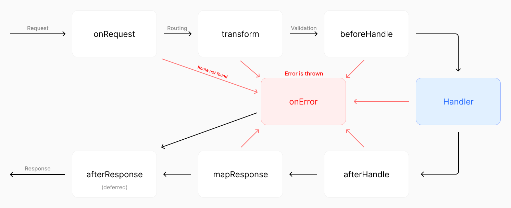

<!-- _class: lead -->

# Seminar 04 – REST APIs, Elysia & Kubb

## PB138 — Basics of Web Development

*"Your frontend and backend finally need to talk. Let's teach them how."*

---

## Agenda

1. HTTP — the language of the web
2. Client-Server lifecycle
3. REST API design
4. Building APIs in TypeScript — Express → Elysia + Zod
5. CORS
6. OpenAPI specification
7. React Hooks & TanStack Query
8. Kubb — code generation from specs

---

<!-- _class: lead -->

# HTTP

*The protocol that powers the internet — built in 1989, still held together with duct tape and optimism*

---

## What is HTTP?

- **H**yper**T**ext **T**ransfer **P**rotocol
- A **request-response** protocol: client asks, server answers
- **Stateless**: every request is independent, server remembers nothing
- Text-based (HTTP/1.1), then binary (HTTP/2, HTTP/3)
- Runs over TCP, usually port `80` (HTTP) or `443` (HTTPS)

```
Client                          Server
│                                    │
│   GET /api/users HTTP/1.1          │
│ ──────────────────────────────────>│
│                                    │
│   HTTP/1.1 200 OK                  │
│   [{"id":1,"name":"Alice"}]        │
│ <──────────────────────────────────│
```

---

## HTTP Message Anatomy

```
Request:                                    Response:
GET /api/users?role=admin HTTP/1.1          HTTP/1.1 200 OK
Host: api.example.com                       Content-Type: application/json
Authorization: Bearer eyJhbGci...           Location: /api/users/42
Content-Type: application/json
                                            {"id": 42, "name": "Alice"}
{"name": "Alice", "email": "a@b.com"}
```

- **Method + Path** — what to do and to which resource
- **Headers** — metadata (auth, content type, caching, CORS...)
- **Body** — data payload (request: POST/PUT/PATCH; response: usually JSON)
- **Query params** — filtering, sorting, pagination (`?role=admin`)
- **Status code** — how it went (in response)

---

## HTTP Methods

| Method   | Purpose              | Has Body? | Idempotent? |
| -------- | -------------------- | --------- | ----------- |
| `GET`    | Read a resource      | No        | Yes         |
| `POST`   | Create a resource    | Yes       | No          |
| `PUT`    | Replace a resource fully | Yes   | Yes         |
| `PATCH`  | Partially update     | Yes       | Usually     |
| `DELETE` | Remove a resource    | No        | Yes         |

**Idempotent** = calling it N times gives the same result as calling it once.

`DELETE /users/1` twice → same state. `POST /users` twice → two users.

---

## HTTP Status Codes

| Range | Category      | Common codes                                                              |
| ----- | ------------- | ------------------------------------------------------------------------- |
| 2xx   | Success       | `200 OK`, `201 Created`, `204 No Content`                                |
| 3xx   | Redirect      | `301 Moved Permanently`, `304 Not Modified`                              |
| 4xx   | Client error  | `400 Bad Request`, `401 Unauthorized`, `403 Forbidden`, `404 Not Found`, `409 Conflict`, `422 Unprocessable Entity` |
| 5xx   | Server error  | `500 Internal Server Error`, `503 Service Unavailable`                   |

> *"Is it a 401 or 403?"*
> `401` = who are you? (not logged in)
> `403` = I know who you are, you just can't do this

---

## Status Codes in Practice

```js
// Correct usage
res.status(201).json(newUser)              // POST — resource created
res.status(200).json(users)                // GET  — here's your data
res.status(204).send()                     // DELETE — done, nothing to return
res.status(404).json({ error: "User not found" })
res.status(400).json({ error: "Invalid input" })
res.status(401).json({ error: "Login required" })
res.status(403).json({ error: "Admins only" })

// What juniors (and some seniors) do
res.status(200).json({ error: "User not found" })  // wrong
res.status(200).json({ success: false })            // wrong
```

Status codes ARE part of your API contract. Clients branch on them.

---

<!-- _class: lead -->

# Client-Server Lifecycle

*What actually happens between `fetch()` and `.json()`*

---

## The Full Journey

```
React App                          Server
│                                           │
│  1. fetch('/api/products')                │
│     DNS: resolve hostname → IP            │
│     TCP: 3-way handshake                  │
│     TLS: negotiate if HTTPS               │
│                                           │
│  2. HTTP Request ────────────────────────>│
│     GET /api/products                     │  3. Router matches path
│     Authorization: Bearer xyz             │  4. Middlewares run (auth, log...)
│                                           │  5. Route handler executes
│                                           │  6. Data fetched (DB / memory)
│  7. HTTP Response <──────────-────────────│
│     200 OK                                │
│     [{"id":1,"name":"Widget"}]            │
│                                           │
│  8. React updates state → re-render       │
```

---

<!-- _class: lead -->

# REST API

*Constraints you'll hate — until you work with an API that ignores them all*

---

## What is REST?

**RE**presentational **S**tate **T**ransfer — an architectural style, not a protocol.

Defined by Roy Fielding in his **2000 PhD dissertation**. Yes, really.

**Core constraints:**

- **Stateless** — server stores no session; each request is self-contained
- **Uniform interface** — resources identified by URLs, standard HTTP methods
- **Client-server** — clear separation of concerns
- **Cacheable** — responses indicate whether they can be cached
- **Layered** — client doesn't know if it talks to a proxy or the real server

---

## Resource-Oriented URLs

Think in **nouns**, not verbs.

```
Verb-based (not REST)          Resource-based (REST)

/getUsers                      GET     /api/users
/createUser                    POST    /api/users
/updateUser?id=1               PUT     /api/users/1
/deleteUser?id=1               DELETE  /api/users/1
/getUserPosts?userId=1         GET     /api/users/1/posts
```

The URL identifies **what**.
The HTTP method identifies **what to do with it**.

---

## Richardson Maturity Model

A way to score how "RESTful" an API actually is.

```
Level 3 │  HATEOAS ——— responses include links to next actions
        │
Level 2 │  HTTP Verbs + Status Codes ——— use methods correctly
        │                          ▲ most real-world APIs live here
Level 1 │  Resources ——— separate URL per resource
        │
Level 0 │  Single Endpoint ——— one URL, everything is POST
```

**Target: Level 2** — correct HTTP methods + status codes. Browsers and CDNs can cache `GET` automatically. `DELETE` is idempotent. Clients branch on status codes, not body parsing.


---

<!-- _class: lead -->

# Building APIs in TypeScript

*From Express to Elysia — how the ecosystem evolved*

---

## Express.js — The Classic

- Minimal, unopinionated web framework for Node.js (2010, still most-used)
- Middleware chain: each request flows through a pipeline of `(req, res, next)`

```js
import express from 'express'

const app = express()
app.use(express.json())                          // parse JSON bodies

app.get('/api/products', (req, res) => {
  res.json(products)
})

app.post('/api/products', (req, res) => {
  const result = CreateProductSchema.safeParse(req.body)  // manual Zod
  if (!result.success) return res.status(400).json({ error: result.error.flatten() })
  const product = { id: crypto.randomUUID(), ...result.data }
  products.push(product)
  res.status(201).json(product)
})

app.listen(3000)
```

Validation, OpenAPI, CORS — all manual setup. No type inference from schemas.

---

<!-- _class: lead -->

# Elysia

*"Ergonomic framework for humans — end-to-end type safety with Bun"*

---

## What is Elysia?

- Modern, ergonomic web framework built for **Bun**
- End-to-end type safety — routes, params, body, response all typed
- Built-in plugin system (CORS, Scalar, etc.)
- Supports **Zod** validation via Standard Schema

```ts
import { Elysia } from 'elysia'

const app = new Elysia()

app.get('/api/health', () => {
  return { status: 'ok' }
})

app.listen(3000)
```

No `express.json()`, no manual response serialization — just return objects.

---

## Elysia Route Handlers

```ts
const app = new Elysia()

// GET all
app.get('/api/products', () => {
  return products
})

// GET one
app.get('/api/products/:id', ({ params: { id }, set }) => {
  const product = products.find(p => p.id === id)
  if (!product) {
    set.status = 404
    return { error: 'Not found' }
  }
  return product
})

// POST — create
app.post('/api/products', ({ body }) => {
  const product = { id: crypto.randomUUID(), ...body }
  products.push(product)
  return product
})
```

Same concepts as Express. Cleaner API — destructure what you need, return objects directly.

---

## Elysia Lifecycle & Middleware

Every request flows through a chain of hooks — similar to Express middleware, but structured:



---

```ts
const app = new Elysia()
  // Guard — returning a value short-circuits the chain (no next() needed)
  .onBeforeHandle(({ set, headers }) => {
    if (!headers.authorization) {
      set.status = 401
      return { error: 'Login required' }
    }
  })
  // Derive — merges return value into context for all handlers below
  .derive(({ headers }) => {
    const user = getUserFromToken(headers.authorization)
    return { currentUser: user }
  })
  .get('/api/profile', ({ currentUser }) => {
    return currentUser  // fully typed, no casting
  })
```

`onBeforeHandle` = guard (reject early). `derive` = enrich context (pass data to handlers).

---

## Plugins & Modularization — `.use()`

`.use()` merges an entire Elysia instance (plugin) into your app — hooks, routes, everything:

```ts
// modules/products.ts — self-contained module
export const products = new Elysia({ prefix: '/products', tags: ['Products'] })
  .get('/', () => productsService.getAll())
  .post('/', ({ body }) => productsService.create(body), {
    body: CreateProductSchema,
  })

// index.ts — compose everything in one place
const app = new Elysia()
  .use(cors())        // plugin: registers CORS hooks internally
  .use(openapi())     // plugin: adds OpenAPI spec gen
  .use(products)      // your module: mounts routes under /products
  .use(students)
  .listen(3000)
```

Same idea in every framework (Express Router, Fastify plugins, ...) — split routes into modules, compose at the top.

---

<!-- _class: lead -->

# Elysia + Zod

*"One Zod schema to validate, type, and document them all"*

---

## The Problem with Separate Concerns

With plain Express, you often maintain things separately:

```
TypeScript interface    →  defines the shape
Zod schema              →  validates the input
Separate tool / config  →  generates the OpenAPI spec
```

Each one can go out of sync. **Elysia + Zod** unifies all three.

---

## Elysia + Zod — Single Source of Truth

**One Zod schema** = types + validation + OpenAPI spec generation:

```ts
import { z } from 'zod'

export const CreateProductSchema = z.object({
  name: z.string().min(1).max(100),
  price: z.number().positive(),
  category: z.enum(['electronics', 'clothing', 'food']),
})

// TypeScript type is inferred — no separate interface needed
type CreateProduct = z.infer<typeof CreateProductSchema>
```

Plain Zod — no special wrappers. Elysia validates input and generates OpenAPI docs automatically.

---

## Route Definitions

Routes are defined with chaining — method, path, handler, schema config:

```ts
import { Elysia } from 'elysia'
import { z } from 'zod'

const app = new Elysia({ prefix: '/products', tags: ['Products'] })

  .get('/', () => products, {
    detail: { description: 'List of products' },
  })

  .post('/', ({ body }) => {
    return productsService.create(body)
  }, {
    body: CreateProductSchema,
    detail: { description: 'Create a product' },
  })
```

Pass a Zod schema in the third argument — Elysia validates automatically and returns 400 on invalid input.

---

## Why Elysia + Zod?

| | Express | Elysia + Zod |
|---|---|---|
| **Types** | manual interfaces | inferred from Zod schemas |
| **Validation** | manual `safeParse` in every handler | automatic — pass schema, done |
| **OpenAPI** | manual / separate tool | built-in from your Zod schemas |
| **DX** | `(req, res, next)`, `res.json()` | destructure context, return objects |
| **Runtime** | Node.js / Bun / Deno | Bun |

Express taught the world backend JS. Elysia builds on those ideas with **less boilerplate and more type safety** — that's why we use it.

---

<!-- _class: lead -->

# Exercise: Setup & Backend

---

## Getting Started

```bash
cd pb138-seminars && git checkout seminar-04-assignment
bun install
bun run dev
```

| URL | What |
|---|---|
| http://localhost:3000 | REST API |
| http://localhost:3000/api-docs | Scalar — explore & test all endpoints |
| http://localhost:5173 | React frontend |

---

## Project Structure

Each backend module has the same layers:

**types** → **schema** (Zod) → **repository** (data) → **service** (logic) → **routes** (Elysia)

Read through the **`students` module** first — it's the reference implementation.

---

<!-- _class: lead -->

# CORS

*"The browser's way of saying: I don't know you like that"*

---

## Same-Origin Policy

Browsers block requests to different origins by default.

**Origin** = protocol + hostname + port

```
http://localhost:5173     ← your React app (Vite)
http://localhost:3000     ← your Express API

Different ports → different origins → browser blocks it
```

This is a **security feature**, not a bug.

Imagine if any website could call `https://yourbank.com/api/transfer`
using your logged-in session cookies... yeah.

---

## CORS — The Solution

**C**ross-**O**rigin **R**esource **S**haring — the server tells the browser which origins it trusts.

```js
// Express
import cors from 'cors'
app.use(cors({ origin: ['http://localhost:5173'] }))

// Elysia — plugin
import { cors } from '@elysiajs/cors'
app.use(cors({ origin: ['http://localhost:5173'] }))
```

The server adds `Access-Control-Allow-Origin` headers.
The browser checks them before showing you the response.

For non-simple requests (custom headers like `Authorization`), the browser sends an `OPTIONS` preflight first. If the server doesn't respond with the right CORS headers → the famous CORS error.

*Works fine in Postman but breaks in the browser? It's always CORS.*

---

## Checkpoint: CORS

- Same-Origin Policy: browsers block cross-origin requests by default
- CORS lets your server declare which origins it trusts
- Never use `origin: '*'` in production (unless it's a truly public API)
- Set `credentials: true` if using cookies or Authorization headers
- CORS errors = server didn't include the right response headers

**Questions?**

---

## Task 1 — Course Filtering

**File:** `apps/server/src/modules/courses/courses.service.ts`

`getAll()` receives a `filter` object but ignores it. Implement four filters:

| Filter | What to do |
|---|---|
| `filter.semester` | Keep courses matching the given semester |
| `filter.tags` | Keep courses that have **all** requested tags |
| `filter.minCredits` / `maxCredits` | Keep courses in credit range (inclusive) |
| `filter.instructorId` | Keep courses taught by that instructor |

Each filter: `if (filter.x) { courses = courses.filter(...) }`

---

## How Do We Verify It Works?

We need a way to **explore and test** our API — send requests, tweak parameters, see responses.

Manually writing `curl` commands or using Postman works... but there's a better way.

What if the API could **describe itself** — and a tool could turn that description into an interactive playground?

That's exactly what **OpenAPI** + **Scalar** do.

---

<!-- _class: lead -->

# OpenAPI

*"Because 'just read the source code' is not documentation"*

---

## What is OpenAPI?

A standard, machine-readable description of your HTTP API.

**One spec, many superpowers:**

- Interactive docs (Scalar, Swagger UI, Redoc)
- Typed client generation — Kubb, orval, openapi-typescript
- Request/response validation
- Contract between frontend and backend teams
- Mock servers for testing before the backend exists

Previously known as **Swagger**. OpenAPI 3.x is the current standard.

---

## Schema-First vs Code-First

Two approaches to owning the spec:

```
Schema-First                    Code-First
────────────────                ────────────────
Write openapi.yaml              Write routes with Zod schemas
│                               │
▼                               ▼
Generate server stubs           Elysia + @elysiajs/openapi extracts the spec
Generate client code            │
│                               ▼
▼                               Generate openapi.json
Implement the handlers
```

**We use code-first** — write your routes with Zod schemas, generate the spec.
More natural, stays in sync with your code automatically.
No YAML authoring by hand at 2am.

---

## OpenAPI Spec — A Peek

```yaml
openapi: 3.0.0
info:
  title: Products API
  version: 1.0.0
paths:
  /api/products:
    get:
      summary: List all products
      responses:
        '200':
          content:
            application/json:
              schema:
                type: array
                items:
                  $ref: '#/components/schemas/Product'
components:
  schemas:
    Product:
      type: object
      required: [id, name, price, category]
      properties:
        id:    { type: string }
        name:  { type: string }
        price: { type: number }
        category: { type: string, enum: [electronics, clothing, food] }
```

---

## Scalar — Your API Playground

Reads `openapi.json` and gives you interactive docs with modern DX:

- Cleaner design, dark mode, auto-generated code examples
- Built-in request builder with history
- Sends real requests, shows live responses
- Every endpoint browsable — no source code reading needed

Alternative: **Swagger UI** — the classic, still widely used. Same idea, older UI.

We use **Scalar** on this course — available at `/api-docs` when you run the server.

---

## Checkpoint: OpenAPI

- Machine-readable API description — one source of truth
- Enables docs, client generation, validation, mock servers
- Schema-first: write YAML → generate code
- Code-first: write code → generate YAML
- We use code-first — stays in sync automatically
- Scalar = interactive docs + live API playground

**Now verify Task 1:** Scalar → `GET /courses` with query params

**Questions?**

---

## Task 2 — Instructor Creation

**Step A — Validation** (`instructor.schema.ts`)

Add constraints to `CreateInstructorBodySchema`:
- `firstName`, `lastName` — non-empty, max 50 chars
- `email` — valid email format
- `department` — non-empty

**Step B — Service** (`instructors.service.ts`)

Implement `create()` — pass data to `instructorsRepository.create()`.

Reference: `students` module has the same pattern.

**Verify:** Scalar → `POST /instructors` — try valid & invalid bodies

---

<!-- _class: lead -->

# React Hooks

*The functions that make React components actually do things*

---

## Built-in Hooks — The Essentials

```tsx
// useState — reactive state
const [count, setCount] = useState(0)
const [user, setUser] = useState<User | null>(null)

// useEffect — side effects (API calls, subscriptions, timers)
useEffect(() => {
  console.log('Component mounted')
  return () => console.log('Component unmounted') // cleanup
}, []) // [] = run once on mount

useEffect(() => {
  console.log('Count changed to', count)
}, [count]) // runs when count changes

// useMemo — expensive computations, cached until deps change
const sorted = useMemo(() => users.sort(byName), [users])

// useRef — mutable value that doesn't trigger re-render
const inputRef = useRef<HTMLInputElement>(null)
```

Rules: only call hooks at the **top level** — never inside `if`, loops, or callbacks.

---

## Custom Hooks

Extract reusable logic into functions starting with `use`.

```tsx
// useLocalStorage — persist state across page reloads
function useLocalStorage<T>(key: string, initial: T) {
  const [value, setValue] = useState<T>(() => {
    const stored = localStorage.getItem(key)
    return stored ? JSON.parse(stored) : initial
  })

  useEffect(() => {
    localStorage.setItem(key, JSON.stringify(value))
  }, [key, value])

  return [value, setValue] as const
}

// Usage — same API as useState, but survives refresh
const [theme, setTheme] = useLocalStorage('theme', 'light')
const [cart, setCart] = useLocalStorage<CartItem[]>('cart', [])
```

Custom hooks = composable, testable, reusable pieces of stateful logic.

---

## TanStack Query — Data Fetching Done Right

```tsx
import { useQuery, useMutation, useQueryClient } from '@tanstack/react-query'

function ProductList() {
  const { data, isLoading, error } = useQuery({
    queryKey: ['products'],
    queryFn: () => fetch('/api/products').then(r => r.json()),
  })

  if (isLoading) return <p>Loading...</p>
  if (error) return <p>Error: {error.message}</p>
  return <ul>{data.map(p => <li key={p.id}>{p.name}</li>)}</ul>
}
```

What you get **for free**: caching, background refetching, deduplication, retry on error, loading/error states, window focus refetching, stale-while-revalidate.

`queryKey` = cache key. Same key → same cached data across components.
`queryFn` = how to fetch. TanStack Query handles **when** and **how often**.

---

<!-- _class: lead -->

# Kubb

*Stop writing `fetch('/api/users')` by hand like it's 2015*

---

## Kubb — Code Generation from OpenAPI

```
Elysia Routes  -->  openapi.json  -->  Generated Code
                   (kubb.config.ts)

                              Fetch clients          React hooks
GET    /products          →  getProducts()          useGetProducts()
POST   /products          →  postProducts(data)     usePostProducts()
GET    /products/:id      →  getProductsById(id)    useGetProductsById()
DELETE /products/:id      →  deleteProductsById(id) useDeleteProductsById()
```

Typed fetch clients **and** React hooks. Backend changes → TypeScript yells at you.

---

## Using Generated Hooks

```tsx
import { useGetProducts } from '@/generated/hooks/useGetProducts'
import { usePostProducts } from '@/generated/hooks/usePostProducts'

// Queries — just call the hook
const { data, isLoading, isError } = useGetProducts()

// With params — e.g. filtering
const { data } = useGetCourses({ semester: 'spring' })

// Mutations — for POST/PUT/DELETE
const mutation = usePostProducts()
mutation.mutate({ name: 'Widget', price: 9.99, category: 'electronics' })
```

Same TanStack Query under the hood. Kubb generates the boring parts — fully typed, zero manual fetch.

---

## Why Kubb

- **Type safety end-to-end** — backend types flow to the frontend automatically
- **No drift** — spec changes → regenerate → TypeScript catches all breakages
- **Zero manual fetch code** — routes, types, React Query hooks all generated
- **Supports many outputs** — Axios, fetch, React Query, SWR, Zod validators

```bash
# Add to package.json
"generate": "kubb generate"

# Run whenever the backend changes:
npm run generate
```

The OpenAPI spec becomes the **single source of truth**.
Frontend and backend can evolve independently — safely.

---

<!-- _class: lead -->

# Exercise: Frontend

---

## Task 3a — Student List

**File:** `apps/web/src/pages/StudentsPage.tsx`

Display all students using the generated hook:

```tsx
import { useGetStudents } from '@/generated/hooks/useGetStudents'

const { data, isLoading, isError } = useGetStudents()
```

Handle loading/error states. Render each student's name, email, and UCO.

Reference: `CoursesPage.tsx` — same pattern, different entity.

---

## Task 3b — Semester Filter

**File:** `apps/web/src/pages/CoursesPage.tsx`

Add a semester filter to the existing courses page:

1. Add state: `const [semester, setSemester] = useState<string>('all')`
2. Pass to hook: `useGetCourses({ semester })`
3. Render a `<Select>` above the course grid: All / Spring / Fall

**Verify:** http://localhost:5173 — dropdown should filter courses live

---

## Task 4 — Create Student Form (homework)

**File:** `apps/web/src/pages/StudentsPage.tsx`

Add a form that creates a new student via the API:

1. State variables for `firstName`, `lastName`, `email`, `uco` (`useState`)
2. `usePostStudents()` hook for the mutation
3. On success: invalidate cache (`queryClient.invalidateQueries`) + reset form
4. Build a `<form>` with `Input` and `Button` components
5. Show `mutation.error` when the server rejects the input

The TODO comment in `StudentsPage.tsx` contains a code skeleton.

---

<!-- _class: lead -->

# Summary

---

## What We Covered

1. **HTTP** — message anatomy, methods, status codes
2. **Client-Server lifecycle** — DNS → TCP → middleware → handler → response
3. **REST** — stateless, resource-oriented, target Level 2
4. **Express.js** — middleware chain, route handlers, Zod validation
5. **Elysia** — modern, ergonomic, built for Bun
6. **Elysia + Zod** — single source of truth: types + validation + OpenAPI
7. **CORS** — why it exists, how to configure it correctly
8. **OpenAPI** — machine-readable spec, code-first approach
9. **React Hooks & TanStack Query** — useQuery, caching, background refetching
10. **Kubb** — typed query options generated from the OpenAPI spec

---

<!-- _class: lead -->

# "A good API is not built once. It's maintained with your future self in mind."

Now let's build something.

*Exercises time!*
